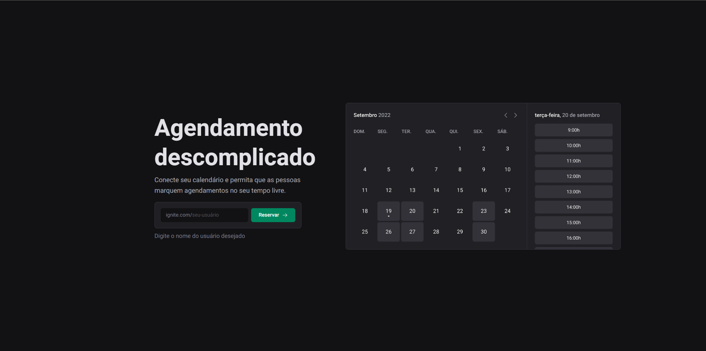

<p align="center">
  
   
  
</p>

<p align="center">
  <a href="#dart-sobre">Sobre</a> &#xa0; | &#xa0;
  <a href="#rocket-tecnologias">Tecnologias</a> &#xa0; | &#xa0;
  <a href="#warning-pré-requisitos"> Pré requisitos</a> &#xa0; | &#xa0;
  <a href="#checkered_flag-começando">Começando</a> &#xa0; | &#xa0;
  <a href="#memo-licença">Licença</a> &#xa0; | &#xa0;
  <a href="https://github.com/geovaneborba" target="_blank">Autor</a>
</p>

## :dart: Sobre

O Ignite Call foi um projeto construído durante o módulo 6 da trilha de React que faz parte do programa de especialização Ignite da Rocketseat. Um projeto que visa simplificar a tarefa de marcar agendamentos e compromissos. Com este aplicativo, você pode conectar seu calendário e permitir que outras pessoas marquem compromissos com você em horários disponíveis em sua agenda. Neste módulo eu aprendi a trabalhar com:

- Rotas autenticadas no Next.js
- Integração com o Google Calendar
- Validações e transformação de dados avançadas com React Hook Forms e Zod
- Manipular cookies no Next.js
- Autenticação OAuth com o Google
- Refresh token do Google
- SEO
- Deploy do Banco de Dados no PlanetScale
- Deploy da aplicação na Vercel


<p align="right">(<a href="#top">Voltar para o topo</a>)</p>

## :rocket: Tecnologias

As seguintes tecnologias foram usadas na construção do projeto:

- [Vite](https://vitejs.dev/)
- [Next.js](https://nextjs.org/)
- [TypeScript](https://www.typescriptlang.org/)
- [Eslint](https://eslint.org/)
- [Prettier](https://prettier.io/)
- [Git Commit Msg Linter](https://www.npmjs.com/package/git-commit-msg-linter)
- [React Hook Form](https://react-hook-form.com/)
- [ZOD](https://github.com/colinhacks/zod)
- [Prisma](https://www.prisma.io/)
- [Axios](https://axios-http.com/ptbr/docs/intro)
- [Google APIS](https://www.npmjs.com/package/googleapis)
- [Next Auth](https://next-auth.js.org/)
- [Next SEO](https://github.com/garmeeh/next-seo)
- [Phosphor React](https://www.npmjs.com/package/phosphor-react)

<p align="right">(<a href="#top">Voltar para o topo</a>)</p>

## :warning: Pré-requisitos

Antes de começar, você precisa ter o [Git](https://git-scm.com) e o [Node](https://nodejs.org/en/) instalados em sua maquina e também um banco de dados MySQL. Crie um arquivo .env e configure as variáveis ambiente de acordo com o .env-example. Será necessário utilizar uma API Key do Google para conseguir utilizar o calendário do google

<p align="right">(<a href="#top">Voltar para o topo</a>)</p>

## :checkered_flag: Começando

```bash
# Clone este repositório
$ git clone https://github.com/geovaneborba/ignite-call.git

# Entre na pasta
$ cd ignite-call

# Instale as dependências
$ npm install

# Execute as migrations
$ npx migrate dev

# Para iniciar o projeto
$ npm run dev

# O app vai inicializar e será informado no terminal o endereço e porta onde estará rodando a aplicação
# geralmente é http://localhost:3000/
```

<p align="right">(<a href="#top">Voltar para o topo</a>)</p>

## :memo: Licença

Este projeto está sob licença MIT. Veja o arquivo [LICENSE](LICENSE.md) para mais detalhes.

<p align="right">(<a href="#top">Voltar para o topo</a>)</p>

<p align="center">Feito com ❤️ por <a href="https://github.com/geovaneborba" target="_blank">Geovane Borba</a></p>
